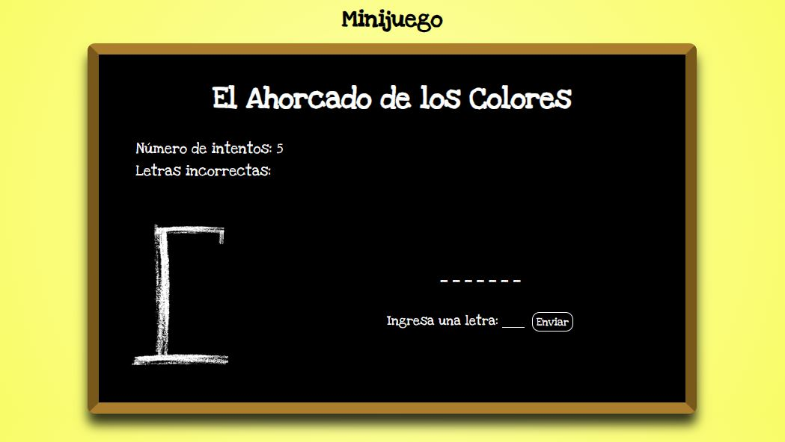

# P1_Juego_Ahorcado_PHP

## OBJETIVO PEDAGÓGICO 
Adquirir y reforzar habilidades prácticas en PHP, aplicando conceptos como manipulación de cadenas, estructuras de control, funciones y formularios web.

## CONTEXTO
El proyecto consiste en la implementación del juego “ahorcado” en PHP sin el uso de bases de datos ni Javascript. El juego debe permitir que un usuario adivine una palabra oculta, mostrando su progreso y controlando los intentos realizados. Este es un desarrollo web donde la lógica del juego se maneja del lado del servidor y se comunica con el cliente mediante formularios web.

## RESULTADO

## Proceso 
### Tecnologías
Para este proyecto he utilizado las tecnologías:
- 

## Pasos de Instalación
1. [Clonar](https://docs.github.com/es/repositories/creating-and-managing-repositories/cloning-a-repository) el repositorio.

2. Abrir el proyecto en Visual Studio Code ( es un editor de código fuente desarrollado por Microsoft para Windows, Linux, macOS y Web).

3. Descarga e Instala XAMPP: Visita la [web](https://www.apachefriends.org/index.html) oficial de XAMPP y descarga la versión compatible con tu sistema operativo (Windows, macOS o Linux). Sigue las instrucciones de instalación proporcionadas en la web.

4. Inicia XAMPP y Apache: Después de instalar XAMPP, inicia la aplicación. Inicia el servidor Apache desde el panel de control de XAMPP.

5. Coloca tu proyecto en la carpeta htdocs: En XAMPP, el directorio home del servidor web es htdocs. Coloca el proyecto en este directorio.

6. Acceda a su proyecto en el navegador: Abra su navegador web y visite la ruta del proyecto colocando de primero el localhost, por ejemplo: http://localhost/P1_Juego_Ahorcado_PHP/src/php/index.php 

7. Disfrútelo.

## Autor 
creado con 💜 por [NathaRuiz](https://github.com/NathaRuiz)